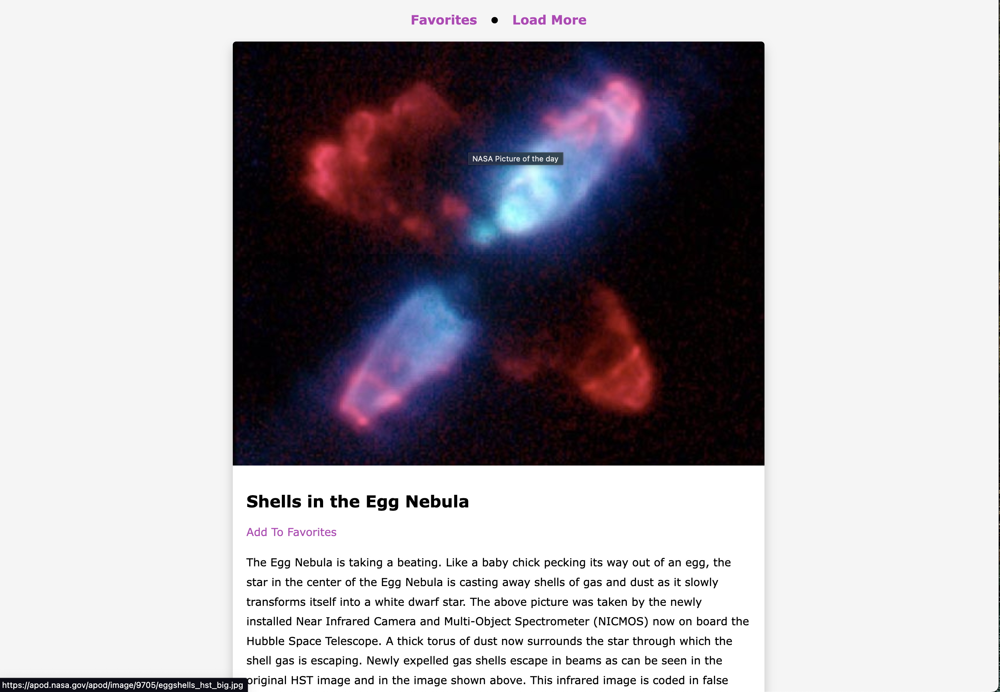

# NASA Api Pictures

##URL site:

https://vasildimov98.github.io/14.nasa-api-pictures/

## Description

Welcome to my site, where the wonders of space come to life! Immerse yourself in breathtaking imagery captured by NASA's satellites, revealing the vast beauty and mysteries of our universe. Through the power of NASA's API, I bring you awe-inspiring photographs that showcase celestial wonders, while providing captivating explanations to deepen your understanding. Embark on a visual journey through the cosmos, exploring distant galaxies, stunning nebulae, and other celestial phenomena. Join me as I unlock the secrets of the cosmos, one captivating image at a time. Get ready to be mesmerized by the wonders of space on my NASA-inspired platform.

